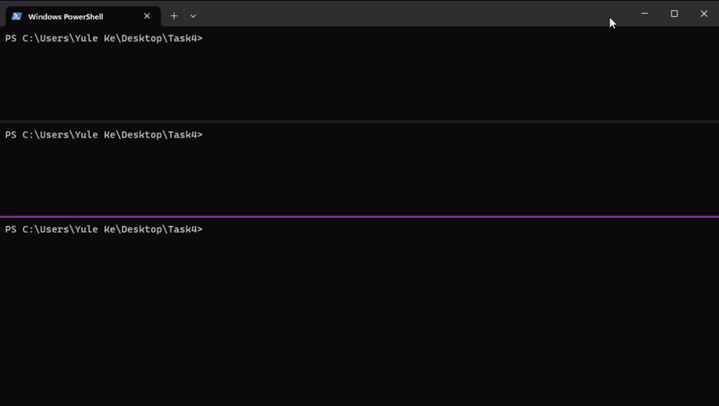

# Task 4

Creating a 3 node Apache Kafka cluster using Docker that demonstrates pub-sub messaging, with a Zookeeper ensemble created to manage the Kafka cluster.

## Report

* [Report](Report/report.md)

## Video

.mp4 and .gif located [here](Report/Video)  

## Running

1. `git clone https://github.com/keyule/3001-Task4.git`
2. `docker-compose up -d`